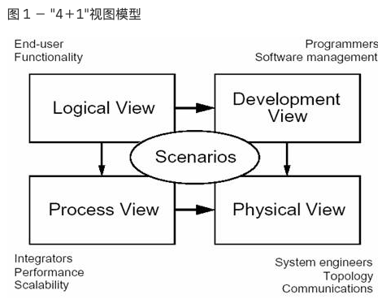

# Welcome to PiRecon Doc 

For full documentation visit [mkdocs.org](https://www.mkdocs.org).

## 架构视图
以下引自[IBM developer社区](https://www.ibm.com/developerworks/cn/rational/r-4p1-view/index.html)

软件架构用来处理软件高层次结构的设计和实施。它以精心选择的形式将若干结构元素进行装配，从而满足系统主要功能和性能需求，并满足其他非功能性需求，如可靠性、可伸缩性、可移植性和可用性。Perry 和 Wolfe 使用一个精确的公式来表达，该公式由 Boehm 做了进一步修改：

`软件架构 ＝ {元素，形式，关系/约束}`

软件架构涉及到抽象、分解和组合、风格和美学。我们用由多个视图或视角组成的模型来描述它。为了最终处理大型的、富有挑战性的架构，该模型包含五个主要的视图（请对照图 1）：

- 逻辑视图（Logical View），设计的对象模型（使用面向对象的设计方法时）。
- 过程视图（Process View），捕捉设计的并发和同步特征。
- 物理视图（Physical View），描述了软件到硬件的映射，反映了分布式特性。
- 开发视图（Development View），描述了在开发环境中软件的静态组织结构。
架构的描述，即所做的各种决定，可以围绕着这四个视图来组织，然后由一些用例 （use cases）或场景(scenarios)来说明，从而形成了第五个视图。正如将看到的，实际上软件架构部分从这些场景演进而来，将在下文中讨论。

我们在每个视图上均独立地应用 Perry & Wolf 的公式，即定义一个所使用的元素集合（组件、容器、连接符），捕获工作形式和模式，并且捕获关系及约束，将架构与某些需求连接起来。每种视图使用自身所特有的表示法－蓝图（blueprint）来描述，并且架构师可以对每种视图选用特定的架构风格（architectural style），从而允许系统中多种风格并存。

### 我的理解
以下是我的个人理解,部分观点引自:

- [CSDN Fenice 软件体系结构——4+1视图](https://blog.csdn.net/Kevin_Samuel/article/details/11928389)

#### 逻辑视图
视角: 最终用户

直观上来讲,逻辑视图指的是抛弃程序本身,而是从操作,参数,数据等抽象概念的角度建立起来的关系图,为了从上至下的解答整个程序包到底能做什么,怎么做的,做到哪里了,谁先谁后等问题. 
从用户的角度来说,其只需要描述我想要你做什么,我想你怎么做等需求,然后建立若干这样的逻辑视图,便可以使具体实施人员了解. 逻辑视图关注的静态元素是：**层、子系统、类、接口**，用类图来描述。关注的
动态因素是**协作关系，用时序图、协作图、状态图**等来描述。从目前的需求出发,逻辑视图层面的文档可能有:

- 组件文档: 将重建工作拆分成为若干组件,每个组件之间存在依赖/逻辑关系. 功能文档旨在用最简单的文档提供近乎所有.**从当前讨论来说,我们还需要赋予其展示每个组件的完成度的功能**
- 子组件文档: 为了减少组件文档的复杂度,需要对每一个组件进行一次或多次的再拆分,从而建立子功能文档.子功能文档的逻辑类似于功能文档
- 工具文档:工具文档是最底层的子功能文档,其提供了最基本工具的结合.
- 数据流文档:每个组件文档,子组件文档及工具文档都需要/可以配合数据来展示数据流文档
- 协作图
  
#### 过程视图
视角: 系统集成者

过程架构考虑一些非功能性的需求，如性能和可用性。它解决并发性、分布性、系统完整性、容错性的问题，以及逻辑视图的主要抽象如何与进程结构相配合在一起－即在哪个控制线程上，对象的操作被实际执行.
过程视图关注进程、线程、对象等运行时概念，以及相关的并发、同步、通信等问题。运行架构和开发架构的关系：开发架构一般偏重程序包在编译时期的静态依赖关系，而这些程序运行起来之后会表现为对象、线程、进程，运行架构比较关注的是这些运行时单元的交互问题。

#### 物理视图
视角:系统工程师 

分别用于开发和测试、部署的物理配置。关注“目标程序及其依赖的运行库和系统软件”最终如何安装或部署到物理机器，以及如何部署机器和网络来配合软件系统的可靠性、可伸缩性等要求。物理视图和过程视图的关系：过程视图特别关注目标程序的动态执行情况，而物理视图重视目标程序的静态位置问题；物理视图还要考虑软件系统和包括硬件在内的整个IT系统之间是如何相互影响的。

#### 开发视图
视角:开发人员

关注的元素是程序包（SDK、解析器、中间件）、文件组织结构、编译依赖关系、目标单元（jar、exe、dll等）。它和逻辑视图的静态元素通常有映射关系。软件打包成小的程序块（程序库或子系统），它们可以由一位或几位开发人员来开发。实际上开发视图的描述主体便是逻辑视图中的组件文档,子组件文档和工具文档内容的程序实现.逻辑视图和开发视图非常接近，但具有不同的关注点。我们发现项目规模越大，视图间的差距也越大。

#### 场景视图
视角: 测试人员,使用人员
在某种意义上场景是最重要的需求抽象。
场景视图的两个作用：
1 作为一项驱动因素来发现架构设计过程中的架构元素。
2 作为架构设计结束后的一项验证和说明功能。

#### 总结
并不是所有的软件架构都需要"4＋1"视图。无用的视图可以从架构描述中省略，比如： 只有一个处理器，则可以省略物理视图；而如果仅有一个进程或程序，则可以省略过程视图。 对于非常小型的系统，甚至可能逻辑视图与开发视图非常相似，而不需要分开的描述。场景对于所有的情况均适用。

## 迭代过程
Witt 等人为设计和架构指出了 4 个阶段：**勾画草图、组织、具体化和优化**，分成了 12 个 步骤。他们还指出需要某种程度的反向工程。而我们认为对于大型的项目，该方法太"线性 化"了。在 4 个阶段的末尾，可用于验证架构的内容太少。我们提倡一种更具有迭代性质的方法，即架构先被原形化、测试、估量、分析(敏捷开发)，然后在一系列的迭代过程中被细化。该方法除了减少与架构相关的风险之外，对于项目而言还有其他优点：团队合作、培训，加深对架构的理解，深入程序和工具等等（此处提及的是演进的原形，逐渐发展成为系统，而不是一次性的试验性的原形）。这种迭代方法还能够使需求被细化、成熟化并能够被更好地理解。

场景驱动（scenario-driven）的方法

系统大多数关键的功能以场景（或 use cases）的形式被捕获。关键意味着：最重要的功能，系统存在的理由，或使用频率最高的功能，或体现了必须减轻的一些重要的技术风险。

### 开始阶段(**先做一个简单版本试试看**):

- 基于风险和重要性为某次迭代选择一些场景。场景可能被归纳为对若干用户需求的抽象。
- 形成"稻草人式的架构"。然后对场景进行"描述"，以识别主要的抽象（类、机制、过程、子系统）
- 所发现的架构元素被分布到 4 个蓝图中：逻辑蓝图、进程蓝图、开发蓝图和物理蓝图。
- *然后实施、测试、度量该架构，这项分析可能检测到一些缺点或潜在的增强要求。*
- 捕获经验教训。

### 循环阶段(**试着能不能扩展**)：

- 重新评估风险，
- 扩展考虑的场景选择板。
- 选择能减轻风险或提高结构覆盖的额外的少量场景，

### 补全阶段(**来,咱们拓展他**):
- 试着在原先的架构中描述这些场景。
- 发现额外的架构元素，或有时还需要找出适应这些场景所需的重要架构变更。
- 更新4个主要视图：逻辑视图、进程视图、开发视图和物理视图。
- 根据变更修订现有的场景。
- *升级实现工具（架构原型）来支持新的、扩展了的场景集合。*
- 测试。如果可能的话，在实际的目标环境和负载下进行测试。
- 然后评审这五个视图来检测简洁性、可重用性和通用性的潜在问题。
- 更新设计准则和基本原理。
- 捕获经验教训。

### 终止循环

为了实际的系统，初始的架构原型需要进行演进 。较好的情况是在经过 2 次或 3 次迭代之后，结构变得稳定：主要的抽象都已被找到。子系统和过程都已经完成，以及所有的接口都已经实现。接下来则是软件设计的范畴，这个阶段可能也会用到相似的方法和过程。

这些迭代过程的持续时间参差不齐，原因在于：所实施项目的规模，参与项目人员的数量、他们对本领域和方法的熟悉程度，以及该系统和开发组织的熟悉程度等等。因而较小的项目迭代过程可能持续 2-3 周（例如，10 K SLOC），而大型的项目可能为 6-9 个月（例如，700 K SLOC）。